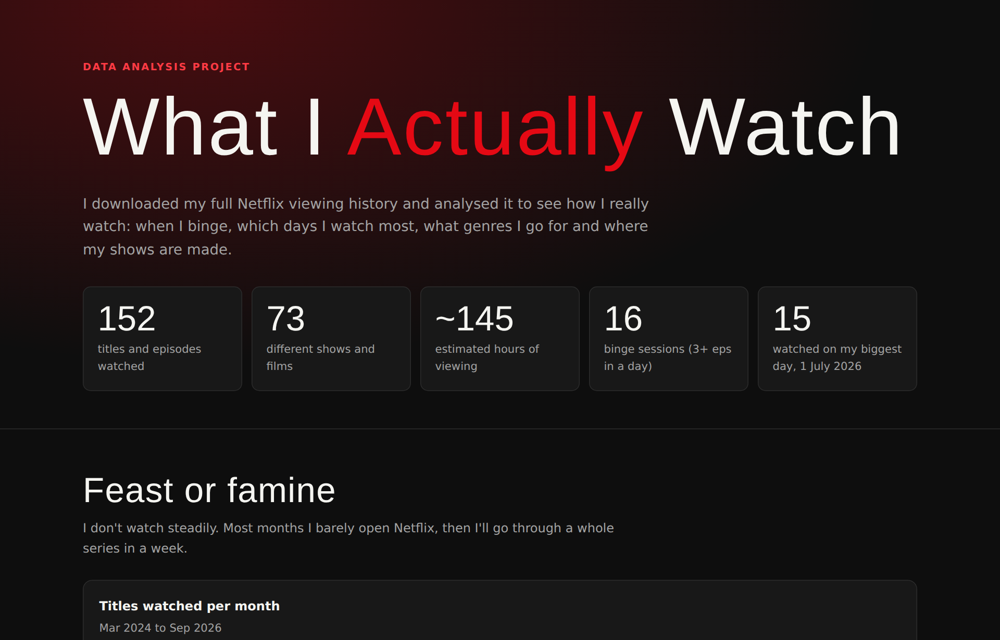
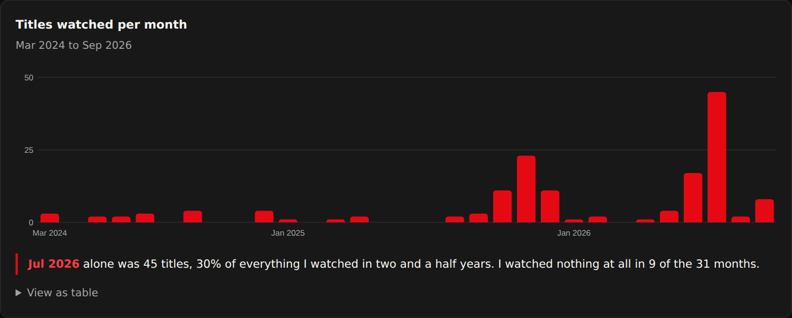
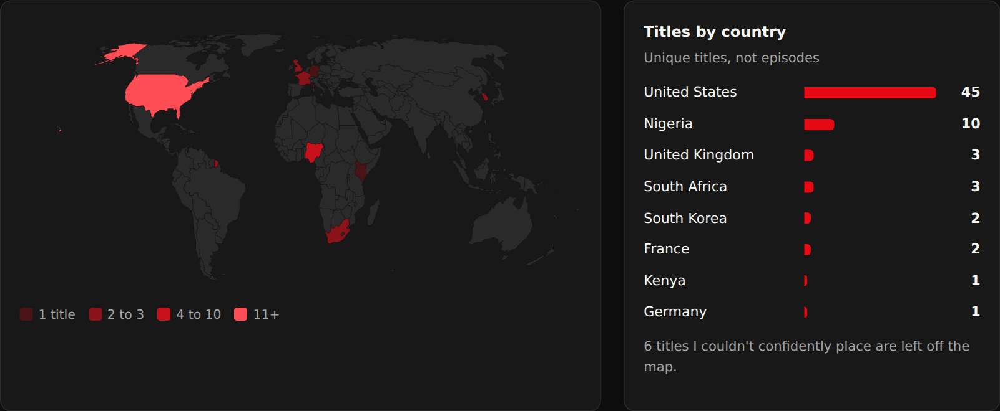

# 🎬 Netflix Viewing Analysis

**What two and a half years of my Netflix history says about how I actually watch.**

👉 **Live site: https://c20744531.github.io/NetflixViewingAnalysis/**



## Key findings

- **152 titles and episodes** across **73 shows and films**, from March 2024 to September 2026 (about **145 hours**, estimated)
- **Feast or famine:** July 2026 alone was 45 titles, 30% of everything. I watched nothing at all in 9 of the 31 months
- **Weekend viewer:** 63% of my viewing happens Friday to Sunday, with Saturday the biggest day
- **Binge watcher:** 16 binge sessions (3+ episodes of one show in a day). The biggest was 8 episodes of *The Night Agent* in one day
- **Crime & Thriller** is my top genre, at a third of all titles
- **Hollywood first, Nollywood second:** after the US, Nigeria is where most of what I watch is made





## How I did it

1. **Exported** my viewing history from Netflix (Account, Profile, Viewing activity, Download all)
2. **Cleaned** it in Python: parsed the dates and split titles like `The Night Agent: Season 3: Orion` into show and episode
3. **Tagged** all 73 titles by hand with genre, film or series, and country of production ([`data/title_tags.csv`](data/title_tags.csv))
4. **Analysed** monthly and weekday patterns, top series, binge sessions, genres and countries ([`analysis.py`](analysis.py))
5. **Visualised** it as a single-page site with hand-built SVG charts and a world map pre-rendered with d3-geo ([`tools/build_map.mjs`](tools/build_map.mjs))

**Note on watch time:** Netflix's export has no durations, so hours are estimated at 45 minutes per episode and 110 minutes per film.

## Run it yourself

```bash
python3 analysis.py                 # writes docs/data.json
npm install d3-geo topojson-client world-atlas
node tools/build_map.mjs            # writes docs/map.svg
cd docs && python3 -m http.server   # open http://localhost:8000
```

Swap in your own `NetflixViewingHistory.csv` and add your titles to `data/title_tags.csv` to analyse your own history.

## Tools

Python · JavaScript · SVG · d3-geo · Natural Earth map data · GitHub Pages
